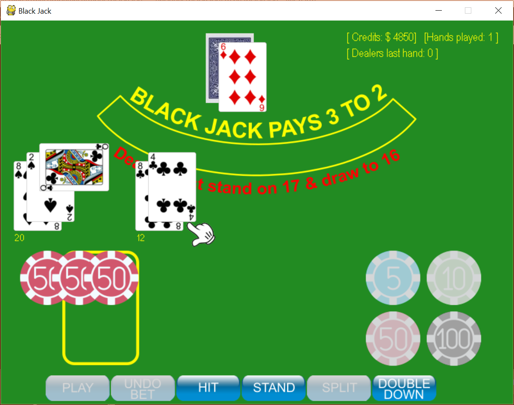

# Black Jack [](https://opensource.org/licenses/MIT)

## Описание
Это игра в блэкджек, написанная на Python с использованием [pygame](https://www.pygame.org/news)  

Целью этого проекта было изучение Python, модульное тестирование и документирование кода Python, а также изучение pygame.

**Скриншот:**


### Предварительные требования для игры

**Pygame:** если вы не установили pygame, вы можете сделать это из командной строки с помощью:   
`pip3 install pygame` 

Клонируйте или загрузите репозиторий на свой локальный компьютер.  

В командной строке *(Linux, Windows или Git bash)* сначала убедитесь, что вы находитесь в корневом каталоге проекта *blackjack*, и введите:   
`python blackjack.py` или `python3 blackjack.py`  


Теперь игра должна запуститься. Если она не запускается, попробуйте выполнить простые действия по устранению неполадок, чтобы убедиться, что вы используете совместимую версию Python:   
`python --version`  
У вас должна быть версия 3.x.x, и если эта команда не работает, то, вероятно, у вас возникли проблемы с путями, которые нужно сначала устранить. Другие проблемы? К сожалению, это то, что вам нужно выяснить самостоятельно.  

### Разработка игр
Распространённый способ написания игр в pygame — создание бесконечного цикла, в котором создаётся и отображается содержимое экрана. В конце цикла вы «переворачиваете» и отображаете обновлённое содержимое с помощью:  
`pygame.display.flip()`  


### Тестирование
Я реализовал несколько наборов тестов, чтобы изучить, как использовать 
[unittest](https://docs.python.org/3/library/unittest.html), и вы найдёте эти тесты в каталоге `~/blackjack/tests`.   
При запуске этих тестов я также изучил, как проверить степень охвата модульных тестов.  Для этого я использовал [coverage](https://coverage.readthedocs.io/en/coverage-4.5.1x/).    

#### Установка coverage
Если вы еще не установили coverage, это легко проверить, введя следующую
команду в командной строке:  
`coverage --version`  
Если это не даст положительного ответа ;) вы действуете как обычно и устанавливаете с
помощью pip:  
"pip3 install coverage"

#### Запустите отчет о покрытии
Измените каталог на "~blackjack/tests/`  
Чтобы запустить один конкретный модульный тест и одновременно сгенерировать отчёт о тестовом покрытии, выполните следующую команду:    
```
coverage run ut_dealers_hand.py
coverage report
```

Следующая команда сгенерирует HTML-отчет в созданном подкаталоге *html*. Чтобы просмотреть его, запустите index.html в браузере.  
`coverage html`  

Если вы хотите объединить результаты нескольких наборов тестов в один отчёт, вы можете сделать это с помощью опции `-a` в команде *coverage run*. См. пример ниже:
```  
coverage run -a ut_dealers_hand.py
coverage run -a ut_players_hand.py
coverage report
coverage html
```
и так далее и тому подобное ;) 

### Автоматическая генерация документов с помощью Sphinx
Чтобы автоматически генерировать документы из встроенных комментариев к исходному коду, я использую Sphinx. Если вы не установили Sphinx, вы можете сделать это из командной строки с помощью:   
`pip3 install -U Sphinx`  

### Упоминания 
Бесплатные игральные карты с 
<https://code.google.com/archive/p/vector-playing-cards/>  
   
Фишки казино от [Smashicons](https://www.flaticon.com/authors/smashicons) с сайта https://www.flaticon.com/
и лицензированы по [CC3.0 BY](http://creativecommons.org/licenses/by/3.0/)

### Не баг, а фича
1. blackjackfsmю.py  str153 - отвечает за максимальную ставку, причем через количество фишек а не денежных единиц. Поигравшись с размерами в файле globals.py можно увеличить это количество путем увеличения самого окна. В принципе ставку можно не ограничивать, просто фишки накладываются друг на друга и при большом количестве стопка фишек уезжает за рамку окна, поэтому и было прописано ограничение по количеству.